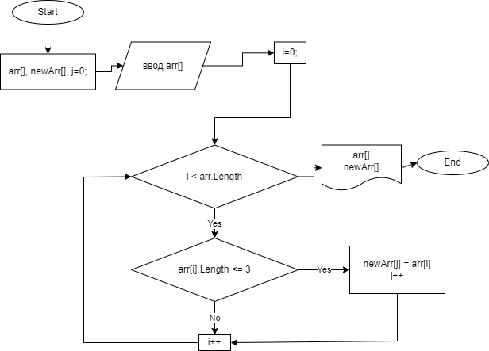

## Итоговая работа

### Оглавление

1. [Описание программы](#описание-программы)
2. [Описание проблемы данного алгоритма](#описание-проблемы-данного-алгоритма)
3. [Блок схема для данной программы](#блок-схема-для-данной-программы)

#### Описание программы

**Данная программа написана на C#**

### Описание проблемы данного алгоритма

    Для ее реализации использован обычные мсассивы. Но данный метод является не самым рациональный, потому, 
    что при создании нового массива в который мы сохраняем данные, которые удовлетворяют нашему условию 
    (длина элемента-строки меньше или равна 3 символам) мы не знаем сколько элементов будет в нашем массиве,
    и приходится создавать новый массив длиной как и первоначальный, и как следствие
    выделяем лишнее не нужное кол-во памяти. 

#### Блок схема для данной программы

